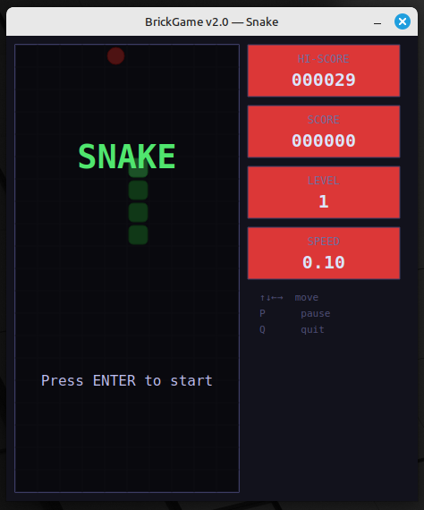
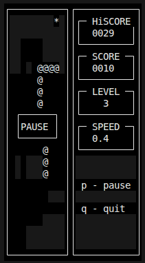

# BrickGame v2.0 (C++17)

`BrickGame v2.0` — **кроссплатформенная реализация классических игр** **Тетрис** и **Змейка** из консоли BrickGame. Проект использует **паттерн MVVM** для Змейки и **C API** для Тетриса, с поддержкой **двух интерфейсов**: **консольного (ncurses)** и **десктопного (Qt5)**.

Змейка реализована с использованием **конечного автомата (FSM)**, механикой уровней, подсчётом очков и рекордов. Тетрис полностью совместим с библиотекой BrickGame v1.0. Оба интерфейса поддерживают обе игры.

#### Основная функциональность:
- **Змейка**: поле 10×20, начальная длина 4, победа при 200 пикселях, повороты ←→↑↓, ускорение Space, пауза P, выход Q
- **Тетрис**: классическая механика, поворот Space, движение ←→↓, пауза P, выход Q
- **Конечный автомат** для Змейки: состояния START/SPAWN/MOVE/COLLIDE/WIN/LOSE
- **Десктопный GUI**: Qt5 Widgets, QPainter, 60 FPS, HUD (score/hi-score/level/speed)
- **Терминальный GUI**: ncurses, совместим с BrickGame v1.0
- **Рекорды**: сохраняются в `hi-score-snake.txt`, `hi-score-tetris.txt`

#### Дополнительная функциональность:
- **MVC-подобная архитектура**: Model (FSM + данные) → Controller (FSM переходы) → View (Qt/ncurses)
- **Unit-тесты**: GTest, покрытие ≥80%, проверка состояний FSM
- **Сборка**: Makefile (all/install/test/gcov_report/style/cpp/valgrind)
- **Стиль кода**: Google C++ Style + clang-format 18.1.3
- **Документация**: Doxygen + FSM-диаграмма `FSM.png`

## Требования

- **ОС**: Linux (Ubuntu/Mint/Debian), macOS, Windows
- **Компилятор**: GCC 9+ / Clang 10+ (C++17)
- **Зависимости**:
    - Консоль: libncurses5-dev, libcheck-dev, lcov, gcovr, clang-format-18
    - Десктоп: qtbase5-dev, qttools5-dev-tools (или Qt6)
- **Утилиты**: make, cmake, valgrind (Linux), leaks (macOS)

**Linux (Mint/Debian):**
```bash
sudo apt install build-essential cmake git libncurses5-dev libcheck-dev \
  lcov clang-format-18 valgrind qtbase5-dev qttools5-dev-tools qtcreator
```

## Сборка проекта

### Терминальная версия (ncurses)
```bash
make clean && make build
```

### Десктопная версия (Qt)
```bash
make clean && make build-qt
```

### Полная сборка + тесты
```bash
make clean all test style cpp valgrind
```

### Установка
```bash
make install  # ./install/brickgame
```

## Запуск приложения

### Терминальная версия
```bash
./brickgame
```
**Управление**: 1/2 (выбор игры), ←→↑↓ (движение), Space (действие), P (пауза), Q (выход)

### Десктопная версия
```bash
./brickgame-qt
```
**Управление**: ENTER (старт), ←→↑↓ (движение), Space (ускорение/поворот), P (пауза), Q (выход)

## Примеры

### Десктопная версия Змейки


### Терминальная версия Тетриса


## Документация

```bash
doxygen Doxyfile                       # Генерация
google-chrome doxygen/html/index.html  # Открыть
```

**Диаграмма FSM Змейки**: `src/FSM.png` — состояния START/MOVE/COLLIDE/WIN/LOSE

**Пример вывода тестов:**
Test module "SnakeModelTests" has passed with: 12/12 cases, 85/85 assertions
Test suite "SnakeTests" has passed with: 100% coverage

text

## Стиль и анализ

```bash
make style              # clang-format check
make cpp                # cppcheck
make valgrind           # leaks/memory
make gcov_report        # Покрытие тестами
```

## Управление в играх

| Клавиша | Змейка (Qt/ncurses) | Тетрис (Qt/ncurses) |
|---------|---------------------|---------------------|
| **↑**   | Вверх              | Поворот            |
| **↓**   | Вниз               | Быстро вниз        |
| **←→**  | Влево/Вправо       | Сдвиг фигуры       |
| **Space**| Ускорение          | Поворот            |
| **P**   | Пауза              | Пауза              |
| **Q**   | Выход              | Выход              |
| **ENTER**| Старт/Рестарт     | Старт/Рестарт      |

**Змейка — механика:**
- Победа: длина ≥200 пикселей
- Поражение: столкновение со стеной/собой
- Уровни: +1 каждые 5 очков (макс. 10), ↑скорость
- Рекорд: hi-score-snake.txt

**Тетрис — механика:**
- Game Over: фигура в верхнем ряду
- Очки: за заполненные линии
- Рекорд: hi-score-tetris.txt

## Совместимость

- ✅ **BrickGame v1.0**: ncurses + Tetris библиотека перенесена
- ✅ **Десктоп**: Qt5/6, поддержка обеих игр
- ✅ **Тесты**: FSM-переходы, коллизии, рекорды

---
*Реализация для 21 School / BrickGame v2.0. C++17, Google Style, MVVM + FSM.*
